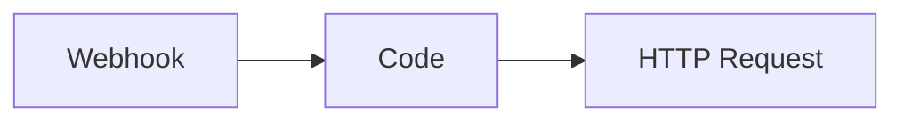

# RiskVoid Security Scanner - User Guide

## Overview

RiskVoid is a security scanner for n8n workflows that detects vulnerabilities like code injection, SSRF, SQL injection, and prompt injection before they reach production. All analysis is performed **100% locally** - no data leaves your n8n instance.

## Table of Contents

- [Installation](#installation)
- [Setting Up API Credentials](#setting-up-api-credentials)
- [Scanning Your Current Workflow](#scanning-your-current-workflow)
- [Scanning Other Workflows](#scanning-other-workflows)
- [Scanning from JSON](#scanning-from-json)
- [Configuration Options](#configuration-options)
- [Understanding the Output](#understanding-the-output)
- [Output Formats](#output-formats)
- [Best Practices](#best-practices)
- [Troubleshooting](#troubleshooting)

---

## Installation

### From npm (Recommended)

```bash
npm install @riskvoid/n8n-nodes-riskvoid
```

### Self-Hosted n8n

1. Install the package in your n8n installation:
   ```bash
   cd ~/.n8n
   npm install @riskvoid/n8n-nodes-riskvoid
   ```

2. Restart n8n:
   ```bash
   n8n start
   ```

### Docker

Add to your `docker-compose.yml`:

```yaml
services:
  n8n:
    environment:
      - N8N_CUSTOM_EXTENSIONS=/data/custom-nodes
    volumes:
      - ./custom-nodes:/data/custom-nodes
```

Then install:

```bash
docker exec -it n8n npm install @riskvoid/n8n-nodes-riskvoid
docker restart n8n
```

---

## Setting Up API Credentials

To scan workflows (including the current workflow), RiskVoid needs access to the n8n API to fetch workflow definitions.

### Step 1: Generate an n8n API Key

1. Open your n8n instance
2. Click on **Settings** (gear icon) in the bottom left
3. Navigate to **API** section
4. Click **Create API Key**
5. Give it a name like "RiskVoid Scanner"
6. Copy the generated API key (you won't be able to see it again!)

### Step 2: Create RiskVoid Credentials

1. In your workflow, click on the **Credentials** menu
2. Click **Add Credential**
3. Search for **"n8n API"** or **"RiskVoid n8n API"**
4. Enter the following:
   - **Name**: Give it a descriptive name (e.g., "RiskVoid API")
   - **API Key**: Paste the API key you copied
   - **Base URL**: Your n8n instance URL (e.g., `http://localhost:5678` or `https://n8n.yourcompany.com`)
     - For local development: `http://localhost:5678`
     - For self-hosted: Your full n8n URL including protocol
     - For n8n cloud: Your cloud instance URL

5. Click **Save**

### Important Notes

- The API key needs **read access** to workflows
- For security, create a dedicated API key just for RiskVoid
- Store credentials securely - never commit them to version control

---

## Scanning Your Current Workflow

The most common use case is scanning the workflow you're currently building.

### Basic Setup

1. **Add the RiskVoid Security node** to your workflow
2. **Connect it** after the nodes you want to scan (or at the end)
3. **Select Operation**: Choose **"Scan Current Workflow"**
4. **Select Credentials**: Choose the n8n API credentials you created
5. **Execute the node**

### Example Workflow

```
Manual Trigger → [Your Workflow Nodes] → RiskVoid Security → Slack (optional)
```

### What Happens

1. RiskVoid fetches the current workflow via the n8n API
2. Analyzes all nodes, connections, and data flows
3. Detects security vulnerabilities
4. Returns a detailed security report

### Viewing Results

The output includes:

- **Risk Score** (0-100): Overall security score
- **Risk Level**: `safe`, `low`, `medium`, `high`, or `critical`
- **Findings**: List of detected vulnerabilities with:
  - Severity
  - Description
  - Affected nodes
  - Data flow path
  - Remediation steps

---

## Scanning Other Workflows

You can scan any workflow in your n8n instance by its ID.

### Finding a Workflow ID

The workflow ID is in the URL when editing a workflow:

```
https://your-n8n-instance.com/workflow/{WORKFLOW_ID}
                                        ^^^^^^^^^^^^
```

Example: `https://n8n.yourcompany.com/workflow/123` → Workflow ID is `123`

### Scanning by ID

1. Add the **RiskVoid Security node**
2. Select Operation: **"Scan Workflow by ID"**
3. Enter the **Workflow ID**
4. Select your **n8n API credentials**
5. Execute

### Use Cases

- **CI/CD Integration**: Scan workflows automatically on deployment
- **Security Audits**: Scan all workflows periodically
- **Multi-Workflow Analysis**: Scan multiple workflows in a loop

### Example: Scanning Multiple Workflows

```
Manual Trigger
  → Code (generate workflow IDs array)
  → Split in Batches
  → RiskVoid Security (Scan by ID: {{ $json.workflowId }})
  → Aggregate Results
  → Send Report
```

---

## Scanning from JSON

For advanced use cases, you can scan workflow JSON directly (useful for CI/CD or external tools).

### Why Use JSON Mode?

- **CI/CD Pipelines**: Validate workflows before deployment
- **External Tools**: Scan workflows from outside n8n
- **Version Control**: Scan workflow files from git repositories

### How to Get Workflow JSON

1. **From n8n UI**:
   - Open the workflow
   - Click **...** (three dots menu)
   - Select **Download**
   - Copy the JSON content

2. **From n8n API**:
   ```bash
   curl -H "X-N8N-API-KEY: your_api_key" \
     https://your-n8n.com/api/v1/workflows/123
   ```

### Encoding to Base64

RiskVoid requires **Base64-encoded JSON** to prevent n8n from evaluating expressions like `{{ $json.field }}`.

#### In Browser Console

```javascript
// Copy your workflow JSON
const workflowJson = { /* your workflow JSON */ };

// Encode to Base64
const base64 = btoa(JSON.stringify(workflowJson));

// Copy the base64 string
console.log(base64);
```

#### Using Command Line

```bash
cat workflow.json | base64
```

#### Using Node.js

```javascript
const fs = require('fs');
const workflow = fs.readFileSync('workflow.json', 'utf8');
const base64 = Buffer.from(workflow).toString('base64');
console.log(base64);
```

### Scanning Base64 JSON

1. Add **RiskVoid Security node**
2. Select Operation: **"Scan Workflow JSON (Base64)"**
3. Paste the **Base64-encoded JSON**
4. Execute

---

## Configuration Options

RiskVoid offers extensive configuration options to customize your security scans.

### Minimum Severity

Filter findings by severity level:

- **All (Including Info)**: Show everything, including informational findings
- **Low and Above**: Skip info-level findings
- **Medium and Above** (default): Focus on actionable vulnerabilities
- **High and Above**: Only critical and high-severity issues
- **Critical Only**: Only show the most severe vulnerabilities

**Recommendation**: Start with "Medium and Above" for regular scans.

### Categories

Filter by vulnerability type:

- **Code/Command Injection**: RCE via Code node or Execute Command
- **Credential Exposure**: Hardcoded secrets or credential leaks
- **Information Disclosure**: Sensitive data exposure
- **Prompt Injection**: AI prompt manipulation attacks
- **Security Misconfiguration**: Insecure settings
- **SSRF**: Server-Side Request Forgery

Leave empty to scan for all categories.

### Output Format

Choose how detailed the output should be:

- **Full Report** (default): Complete analysis with all details
- **Summary**: Risk score and statistics only
- **Findings Only**: Just the list of vulnerabilities

### Export Format

Choose the output format:

- **JSON (Default)**: Structured JSON output
- **HTML Report**: Self-contained HTML report with visualizations
- **Slack Blocks**: Ready-to-post Slack message format
- **SARIF 2.1.0**: Static Analysis Results Interchange Format for CI/CD tools

### Include Remediation

Toggle detailed remediation guidance (default: enabled).

When enabled, each finding includes:
- Step-by-step fix instructions
- Code examples
- Best practices
- Reference links

### Include Mermaid Diagram

Add a Mermaid.js workflow diagram to the output (available for JSON and HTML formats).

**Example workflow visualization**:


---

## Understanding the Output

### Risk Score (0-100)

- **0-20**: Safe ✅
- **21-40**: Low Risk 🟡
- **41-60**: Medium Risk 🟠
- **61-80**: High Risk 🔴
- **81-100**: Critical Risk ⛔

### Risk Level

- `safe`: No security issues detected
- `low`: Minor issues that don't pose immediate risk
- `medium`: Issues that should be addressed
- `high`: Serious vulnerabilities requiring immediate attention
- `critical`: Severe vulnerabilities that could lead to data breach or RCE

### Finding Structure

Each finding includes:

```json
{
  "id": "RV-RCE-001-abc123",
  "ruleId": "code-injection-taint",
  "severity": "critical",
  "confidence": "high",
  "title": "Remote Code Execution via User Input",
  "description": "Untrusted data from 'Webhook' flows directly to code execution in 'Code' node...",
  "category": "injection",
  "source": {
    "node": "Webhook",
    "field": "body.userInput"
  },
  "sink": {
    "node": "Code",
    "field": "jsCode"
  },
  "path": ["Webhook", "Set", "Code"],
  "remediation": {
    "summary": "Validate and sanitize all user input before passing to code execution",
    "steps": [
      "Add an IF node to validate input format",
      "Use allowlist validation for expected values",
      "Avoid direct string interpolation in code"
    ]
  },
  "references": [
    "https://owasp.org/www-community/attacks/Code_Injection",
    "https://docs.n8n.io/integrations/builtin/core-nodes/n8n-nodes-base.code/"
  ]
}
```

### Summary Statistics

```json
{
  "totalFindings": 3,
  "bySeverity": {
    "critical": 1,
    "high": 1,
    "medium": 1,
    "low": 0,
    "info": 0
  },
  "byCategory": {
    "injection": 2,
    "ssrf": 1
  }
}
```

---

## Output Formats

### JSON Output (Default)

Structured JSON for programmatic processing.

**Use cases**:
- Storing results in databases
- Further processing in workflows
- API integration
- Custom dashboards

### HTML Report

Beautiful, self-contained HTML report with:
- Interactive visualizations
- Color-coded severity levels
- Collapsible sections
- Mermaid workflow diagrams
- Print-friendly styling

**Use cases**:
- Sharing with security team
- Executive reports
- Documentation
- Email attachments

**How to use**:
```
RiskVoid Security → Set (save HTML) → Send Email with attachment
```

Access the HTML via: `{{ $json.html }}`

### Slack Blocks

Pre-formatted Slack Block Kit JSON for posting to Slack channels.

**Setup**:
```
RiskVoid Security
  → Slack (Send Message)
    - Blocks field: {{ JSON.stringify($json.slackMessage) }}
    - Text field: {{ $json.text }}
```

**Output includes**:
- Risk score badge
- Severity breakdown
- Top findings
- Clickable workflow link

### SARIF (Static Analysis Results Interchange Format)

Industry-standard format for CI/CD integration.

**Compatible with**:
- GitHub Code Scanning
- GitLab SAST
- Azure DevOps
- SonarQube
- Jenkins

**Example GitHub Action**:
```yaml
- name: Scan n8n Workflow
  run: |
    # Run RiskVoid scan and save SARIF
    n8n execute --workflow=scan.json --output=results.sarif

- name: Upload SARIF
  uses: github/codeql-action/upload-sarif@v2
  with:
    sarif_file: results.sarif
```

---

## Best Practices

### 1. Scan Early, Scan Often

- Add RiskVoid to **every workflow** during development
- Scan **before deploying** to production
- Schedule **periodic scans** of existing workflows

### 2. Start with Medium Severity

- Begin with "Medium and Above" to avoid noise
- Gradually increase sensitivity as you fix issues
- Use "All" for final pre-deployment scans

### 3. Prioritize Critical Findings

Focus on:
1. **Code/Command Injection** (Critical) - Can lead to RCE
2. **SQL Injection** (High) - Data breach risk
3. **SSRF** (High) - Internal network exposure
4. **Credential Exposure** (Medium) - Secret leakage

### 4. Create a Security Gate

Set up a workflow that blocks deployments if critical issues are found:

```
Webhook (Deploy Request)
  → RiskVoid Security
  → IF (risk level = critical)
    → TRUE: Slack (Block deployment) + Stop
    → FALSE: Continue deployment
```

### 5. Track Security Over Time

Store scan results in a database to track improvement:

```
RiskVoid Security
  → Postgres (Insert results)
  → Grafana Dashboard
```

### 6. Educate Your Team

- Share findings with developers
- Include remediation steps in tickets
- Create internal security guidelines based on common issues

### 7. Use Remediation Guidance

Every finding includes:
- Clear explanation of the vulnerability
- Step-by-step fix instructions
- Code examples
- External references

Follow these to fix issues correctly.

---

## Troubleshooting

For detailed troubleshooting, see the **[Troubleshooting Guide](TROUBLESHOOTING.md)**.

### Common Issues Quick Reference

| Issue | Quick Fix |
|-------|-----------|
| Node doesn't appear | Restart n8n after installation |
| "API key required" | Create credentials: Settings → API → Create Key |
| "Workflow not saved" | Save workflow (Ctrl/Cmd + S) first |
| "Invalid Base64" | Use `btoa(JSON.stringify(workflow))` in browser |
| No findings shown | Set severity to "All" and remove category filters |
| Too many false positives | Increase severity to "High and Above" |

**Full troubleshooting guide**: [TROUBLESHOOTING.md](TROUBLESHOOTING.md)

---

## Example Workflows

### Example 1: Basic Security Scan

```
Manual Trigger
  → RiskVoid Security (Scan Current Workflow)
  → Code (Process results)
```

### Example 2: Security Gate for Deployments

```
Webhook (Deploy Trigger)
  → RiskVoid Security (Scan by ID)
  → IF ({{ $json.riskLevel === 'critical' }})
    → TRUE: Slack (Alert + Block)
    → FALSE: GitHub (Deploy + Notify)
```

### Example 3: Scheduled Security Audit

```
Schedule Trigger (Daily)
  → HTTP Request (Get all workflow IDs from n8n API)
  → Split in Batches
  → RiskVoid Security (Scan by ID)
  → Aggregate
  → Postgres (Store results)
  → Slack (Send daily report)
```

### Example 4: HTML Report via Email

```
Manual Trigger
  → RiskVoid Security (Export Format: HTML Report)
  → Send Email
    - Subject: "Security Scan Report"
    - HTML: {{ $json.html }}
    - Attachments: Report
```

### Example 5: CI/CD Integration

```
Webhook (GitHub Push)
  → HTTP Request (Fetch workflow JSON from repo)
  → Code (Base64 encode)
  → RiskVoid Security (Scan JSON)
  → IF (has critical findings)
    → TRUE: GitHub API (Create issue)
    → FALSE: Continue pipeline
```

---

## Getting Help

### Documentation

- **Architecture**: [POC Overview](00-POC-OVERVIEW.md)
- **Development**: [Phase PRDs](/)
- **API Reference**: Code documentation in `/src`

### Support

- **GitHub Issues**: [Report bugs or request features](https://github.com/riskvoid/n8n-nodes-riskvoid/issues)
- **Community**: [n8n Community Forum](https://community.n8n.io/)

### Contributing

Found a false positive? Want to add a new rule? Contributions welcome!

See [CONTRIBUTING.md](../CONTRIBUTING.md) for guidelines.

---

## Security & Privacy

✅ **100% Local Analysis**: All scanning happens on your n8n instance
✅ **No Telemetry**: Zero data collection or phone-home
✅ **No External APIs**: No third-party services contacted
✅ **Open Source**: Fully auditable code
✅ **Transparent**: Clear documentation of what's analyzed and how

Your workflow data never leaves your infrastructure.

---

## License

MIT License - See [LICENSE](../LICENSE) for details

---

## Changelog

See [CHANGELOG.md](../CHANGELOG.md) for version history and updates.
